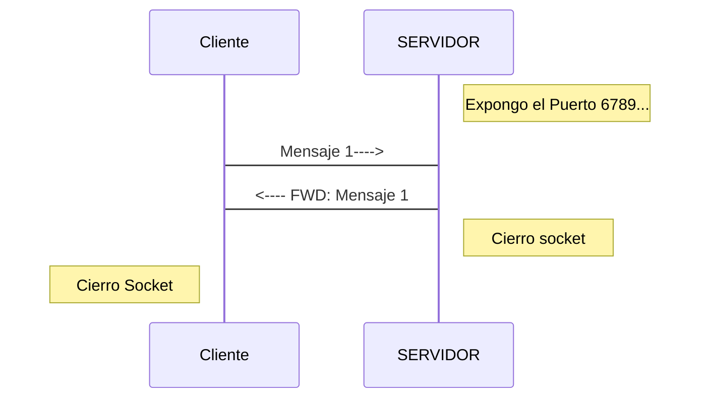

## Conexion UDP entre Cliente & Servidor
Sencillo ejemplo en el que utilizamos las clases `DatagramSocket` y `DatagramPacket` con el uso de `buffers`.

Se trata de un servidor que reenvía el mismo mensaje que le envía el cliente.





### **Código del Cliente**

```java
package Cliente;


import java.net.*;
import java.io.*;

public class Cliente {


  public static void main(String args[]) throws SocketException {

  DatagramSocket dsc = new DatagramSocket();

  
  byte[] bufferSalida = new byte[512];
  // Declaramos el puerto del servidor
  int puertoServidorRemoto = 6789;
          try {
            // Componemos el mensaje
            String mensaje = "Hola soy tu vecino";
            // Lo pasamos al buffer en bytes
            bufferSalida = mensaje.getBytes();
            
            
            // Datos del Servidor
            // Declaramos la direccion del host local
            InetAddress hostServidorRemoto = InetAddress.getByName("localhost"); // Devuelve la IP del host local
            // Declaramos la direccion del servidor
            //InetAddress hostServidorRemoto = hostLocal; // Por motivos obvios estamos en la misma maquina haciendo las pruebas
            
            // Declaramos el datagrama a enviar al servidor
            DatagramPacket datagramaSalida = new DatagramPacket(bufferSalida, bufferSalida.length, hostServidorRemoto,puertoServidorRemoto);
            // Enviamos el datagrama
            dsc.send(datagramaSalida);
            // Notificamos del envio
            System.out.println("Mensaje enviado al servidor");
            
  
            //MENSAJE ENTRANTE

            // Declaramos y reservamos el buffer para alamcenar el datagrama entrante
            byte[] buferRecepcion = new byte[1024];
            // Declaramos el datagrama a recibir y el buffer que lo almacena
            DatagramPacket datagramaEntrada = new DatagramPacket(buferRecepcion, buferRecepcion.length);
            // Recibimos el datagrama
            dsc.receive(datagramaEntrada);
            // Notificamos de la recepcion
            System.out.println("Nuevo mensaje recibido");
            // Pasamos el buffer en bytes a String el datagrama recibido
            String MensajeEntrante = new String(datagramaEntrada.getData());
            // Mostramos el mensaje
            System.out.print("Cuerpo del mensaje: " + MensajeEntrante +"\n fin");
            // Cerramos el socket
        
          dsc.close();
          
          dsc = null; //Por seguridad
            
      
    } catch (SocketException e) {
      System.out.println("Socket: " + e.getMessage());
    } catch (IOException e) {
      System.out.println("IO: " + e.getMessage());
    }
  }
}
```

> Para el envio de mensajes, creamos un buffer de una longitud acorde a la del servidor, transforma un mensaje tipo string a bytes para posteriormente pegarlo al buffer y por ultimo, seteamos la direccion y el puerto del servidor.
> Una vez tenemos todos los datos preparamos el paquete saliente esta listo para ser enviado al servidor.
> Para la recepcion de mensajes, declaramos el buffer 


#### **Código del Servidor**


```java
import java.net.*;
import java.io.*;

public class Servidor {

  public static void main (String args[]) {

    try {
      
      // Exponemos el puerto local para recibir datagramas
      DatagramSocket ds = new DatagramSocket(6789);
      
      //Declaramos y reservamos el buffer para almacenar datagramas
      byte[] bufferRecepcion = new byte[1024];

      while (true) {
        
         // Declaramos el datagrama a recibir y el buffer que lo almacena
        DatagramPacket datagramaEntrada = new DatagramPacket(bufferRecepcion, bufferRecepcion.length);

        // Recibimos el datagrama
        ds.receive(datagramaEntrada);

        // Conseguimos la info del host recibido
        System.out.print("Datagrama recibido del host: " + datagramaEntrada.getAddress());
        System.out.println(" desde el puerto remoto: " + datagramaEntrada.getPort());

        // Declaramos el datagrama de salida a partir de los datos del detagrama de Entrada 
        DatagramPacket datagramaSalida = new DatagramPacket(datagramaEntrada.getData(), //Seteamos el buffer
                                                            datagramaEntrada.getLength(), //Seteamos la logitud del buffer
                                                            datagramaEntrada.getAddress(), //Seteamos la direccion del host remoto
                                                            datagramaEntrada.getPort()); //Seteamos el puerto del host remoto

        // Enviamos el datagrama de salida, que en sí es un clon del datagrama de entrada
        ds.send(datagramaSalida);
        ds.close();
        
        System.out.println("Mensaje reenviado al cliente");
      }

    } catch (SocketException e) {
      System.out.println("Socket: " + e.getMessage());
    } catch (IOException e) {
      System.out.println("IO: " + e.getMessage());
    }
  }

}

```

> En el servidor exponemos el puerto 6789 y lo dejamos a la espera del mensaje del cliente, este cuando reciba el correo del cliente se reenviara al cliente.
